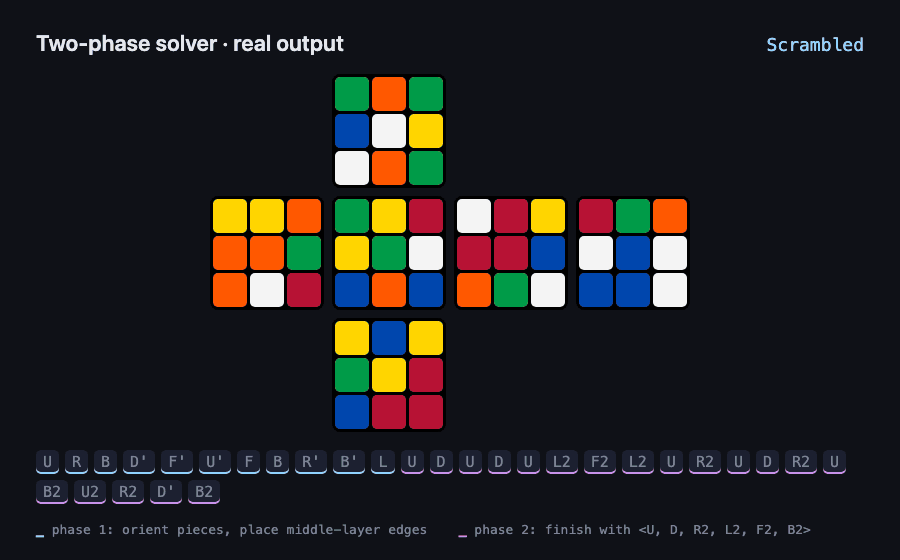

<div align="center">

# Two-Phase Rubik's Cube Solver

**Solves a scrambled 3×3 Rubik's Cube in about half a second, in under 1,400 lines of dependency-free Java.**

A from-scratch implementation of Herbert Kociemba's two-phase algorithm: coordinate move tables, BFS-built pattern databases and IDA* search.

   



<sub>The solver's actual output for a random 25-move scramble, replayed move by move.</sub>

</div>

## Results

Measured on an Apple M2 with the included benchmark ([`bench/benchmark.py`](bench/benchmark.py)). It generates random 25-move scrambles with an independent sticker-level simulator, runs the solver on each one, and replays every solution with `VerifySolution` to confirm the cube ends up solved.

| Metric | Result |
| --- | --- |
| Scrambles solved and verified | **30 / 30** |
| Median wall time per solve | **0.55 s** (includes JVM start-up and building every table) |
| Slowest solve | 1.28 s |
| Solution length | at most **30** face turns (enforced cap) |
| Lookup tables built at start-up | about 4 million pattern-database entries, in memory |

## How it works

A Rubik's Cube has about 4.3 × 10¹⁹ states, far too many to search directly. The two-phase algorithm splits the problem into two smaller searches.

```
 scrambled cube ──► Phase 1 ──► cube in subgroup G1 ──► Phase 2 ──► solved
                    any of 18 moves                     only U, D, R2, L2, F2, B2
```

**Phase 1** moves the cube into the subgroup *G1*, where every corner and edge is correctly oriented and the four middle-layer edges sit in the middle layer. **Phase 2** solves the rest using only moves that keep the cube inside *G1*.

### 1. Two cube representations
- `FaceCube` reads the 54 stickers from the input file and converts them into a `CubieCube`.
- `CubieCube` stores which piece sits in each slot and how it is twisted, with permutation and orientation arrays for the 8 corners and 12 edges. Moves are applied as table-driven permutations.

### 2. Coordinates
Each phase only needs part of the cube's state, so that part is compressed into small integers:

| Phase | Coordinate | Size | Encoding |
| --- | --- | --- | --- |
| 1 | Corner orientation | 3⁷ = 2,187 | base-3 digits; the 8th corner is implied by parity |
| 1 | Edge orientation | 2¹¹ = 2,048 | bitmask; the 12th edge is implied |
| 1 | Middle-layer edge positions | C(12,4) = 495 | combinatorial number system |
| 2 | Corner permutation | 8! = 40,320 | Lehmer code |
| 2 | Top and bottom edge permutation | 8! = 40,320 | Lehmer code |
| 2 | Middle-layer edge permutation | 4! = 24 | Lehmer code |

### 3. Move tables and pattern databases
For every coordinate value and every move, a **move table** stores the resulting coordinate. A breadth-first search outward from the solved state then fills four **pattern databases** with the exact number of moves needed to solve each pair of coordinates:

- Phase 1: corner orientation × slice positions, and edge orientation × slice positions (about 2.1 million entries)
- Phase 2: corner permutation × slice permutation, and edge permutation × slice permutation (about 1.9 million entries)

Distances are stored as one byte each, and all of this is built in memory at start-up in well under a second.

### 4. IDA* search
Both phases use iterative-deepening depth-first search. The heuristic is the **maximum of two pattern-database lookups**. Each lookup is a true lower bound, so the maximum never overestimates and the search never wrongly cuts off a branch. The search also:

- skips a move that turns the same face twice in a row (for example `U` then `U2`), which removes redundant branches
- searches phase 2 only from positions that phase 1 reached, with the remaining move budget
- stops after a 20-second deadline and a 30-move cap

## Getting started

Requires **JDK 24+** and **Maven**.

```bash
git clone https://github.com/rishon-g/rubiks-cube-solver.git
cd rubiks-cube-solver
mvn clean compile
```

### Solve a cube

```bash
mvn exec:java -Dexec.mainClass="rubikscubesolver.Solver" \
  -Dexec.args="scrambles/scramble01.txt scrambles/output.txt"
```

### Input format

A 9-line cube net: Up face, then Left, Front, Right and Back side by side, then Down. One letter per sticker (`W` `Y` `G` `B` `R` `O`), no spaces.

```
   OOG
   OOW
   OOW
YGGWWRBBOYBB
GGGWWOYBBYYY
GGGWWWOBBYYY
   RRB
   RRR
   RRR
```

### Output format

A single line of face letters, where each letter is one clockwise quarter turn. `U` is U, `UU` is U2 and `UUU` is U′.

### Verify a solution

```bash
mvn exec:java -Dexec.mainClass="rubikscubesolver.VerifySolution" \
  -Dexec.args="scrambles/scramble01.txt scrambles/output.txt"
```

### Run the benchmark

```bash
mvn clean compile
python3 bench/benchmark.py 30 25   # 30 random scrambles of 25 moves each
```

## Project structure

```
src/main/java/rubikscubesolver/
├── Solver.java          # coordinates, move tables, pattern databases, two-phase IDA*
├── CubieCube.java       # piece-level cube model and face turns
├── FaceCube.java        # sticker net → piece model conversion
└── VerifySolution.java  # replays a solution and checks the cube is solved
bench/
├── cube.py              # independent sticker-level simulator and scramble generator
└── benchmark.py         # solve + verify + timing harness
scrambles/               # sample input and output
```

## Possible improvements

- **Shorter solutions.** The search returns the first solution under the 30-move cap. Continuing the search with a shrinking cap would trade time for shorter solutions, as Kociemba's full solver does.
- **Faster search.** The search currently applies moves to a full `CubieCube` at each step. Moving the search entirely onto the coordinate move tables would make each node much cheaper.
- **Symmetry reduction.** Using the cube's 16 symmetries would shrink the tables and allow larger, sharper pattern databases.

## Author

**Rishon Ghosh** · [GitHub](https://github.com/rishon-g)
